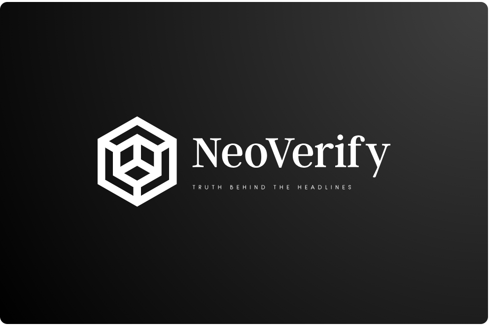
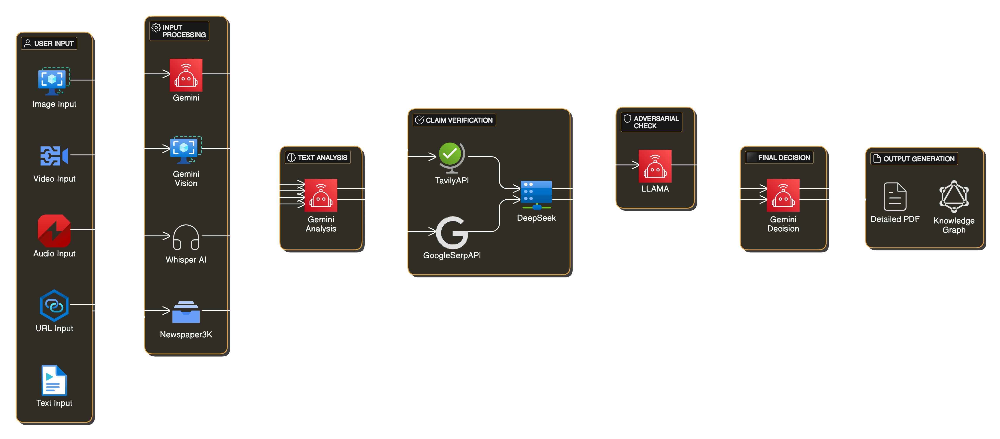
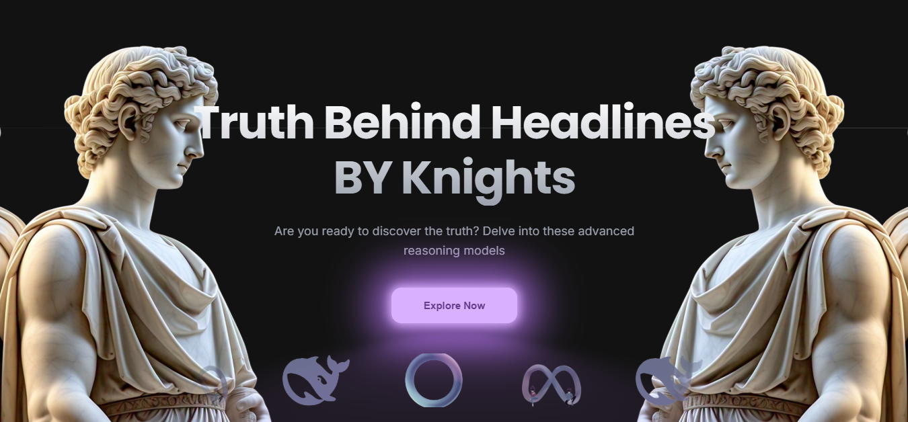
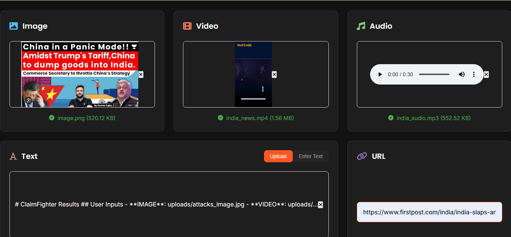
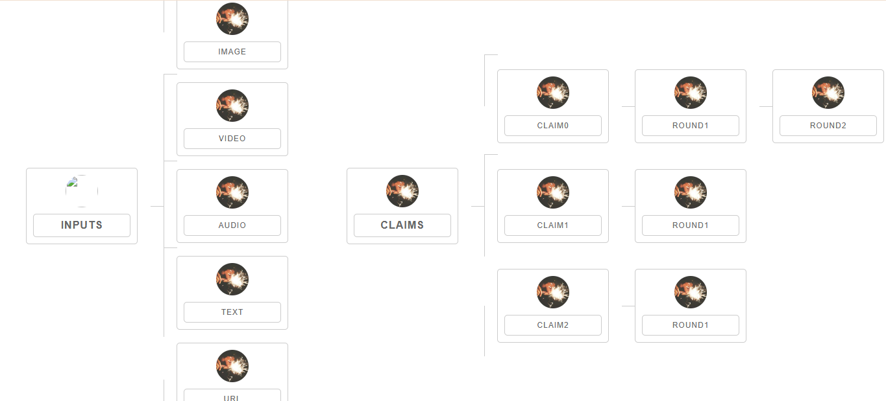
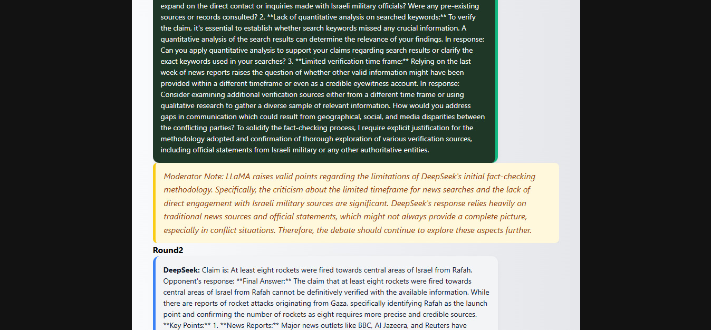

# NeoVerify - Advanced News Verification System

**NeoVerify** is a sophisticated news verification system that analyzes multimedia content and verifies claims through an AI-powered debate process. It helps users identify misinformation by pitting different AI models against each other in structured debates.

## 📋 Table of Contents
- [System Overview](#system-overview)
- [Features](#features)
- [Technology Stack](#technology-stack)
- [Installation](#installation)
- [Usage](#usage)
- [How It Works](#how-it-works)
- [System Architecture](#system-architecture)
- [Demo](#demo)
- [Contributing](#contributing)
- [Contact](#contact)

## 🔍 System Overview

NeoVerify is designed to combat misinformation by extracting and verifying claims from various media types. The system utilizes multiple AI models (Llama, DeepSeek, and Gemini) to debate and fact-check claims, providing users with a comprehensive analysis of potentially misleading information.

## ✨ Features

- **Multi-modal Input Processing**: Analyze text, images, videos, audio, and web URLs
- **Automatic Claim Extraction**: Identify claims from processed content
- **AI-Powered Debate**: Structured debate between LLMs to examine claims from different perspectives
- **Fact Checking**: Integration with Tavily Search API for real-time fact verification
- **Knowledge Graph**: Visual representation of the debate and fact-checking process
- **Conversation View**: Interactive display of the model debate
- **Markdown Reports**: Comprehensive reports of the analysis process and results

## 🔧 Technology Stack

- **fantom_code_final/backend**: Python, Flask
- **AI Models**:
  - Llama (via Groq API)
  - DeepSeek (via Groq API)
  - Gemini (via Google AI API)
- **Other Technologies**:
  - Whisper (for audio transcription)
  - OpenCV (for video frame extraction)
  - Newspaper3k (for web content extraction)
  - Tavily API (for fact-checking)
  - SerpAPI (for Google lens integration)

## 🚀 Installation

### Prerequisites
- Python 3.8+
- pip package manager
- API keys for:
  - Groq (for Llama and DeepSeek models)
  - Google AI (for Gemini models)
  - Tavily (for search functionality)
  - SerpAPI (optional, for Google lens integration)

### Setup

1. Clone the repository:
```bash
git clone https://github.com/yourusername/NeoVerify.git
cd NeoVerify
```

2. Create a virtual environment:
```bash
python -m venv venv
source venv/bin/activate  # On Windows: venv\Scripts\activate
```

3. Install dependencies:
```bash
pip install -r requirements.txt
```

4. Create an `api.key` file in the project root with your API keys:
```
GROQ_API_KEY=your_groq_api_key
GEMINI_API_KEY=your_gemini_api_key
TAVILY_API_KEY=your_tavily_api_key
SERP_API_KEY=your_serpapi_key
```

5. Create necessary directories:
```bash
mkdir uploads
mkdir static
```

## 💻 Usage

1. Start the Flask application:
```bash
python app.py
```

2. Open your browser and navigate to:
```
http://localhost:5000
```

3. Use the interface to:
   - Upload media files (images, videos, audio)
   - Enter text directly
   - Provide a URL for analysis
   - Submit for processing
   - View the debate results and knowledge graph

## ⚙️ How It Works

NeoVerify operates through a sequential process:

1. **Input Processing**: Various media inputs are processed and converted to textual descriptions
   - Images: Described using Gemini Vision
   - Videos: Key frames extracted and described
   - Audio: Transcribed using Whisper
   - URLs: Content extracted using Newspaper3k

2. **Claim Extraction**: Gemini analyzes the processed text to identify claims that need verification

3. **Debate Process**: For each claim:
   - DeepSeek and Llama engage in a debate
   - Llama plays the adversarial role, challenging DeepSeek
   - Gemini serves as the arbitrator

4. **Fact Checking**: When factual questions arise during the debate:
   - Gemini identifies key questions
   - Tavily Search API retrieves relevant information
   - The information is fed back into the debate

5. **Results Generation**:
   - Markdown report with the full analysis
   - Knowledge graph visualization
   - Conversational view of the debate

## 🏗️ System Architecture

The system consists of several key components:

### `Description` Class (preprocessor.py)
Handles multi-modal content processing, extracting textual information from various media types.

### `NeoVerify` Class (fighter.py)
The main orchestrator that:
- Initializes API connections
- Processes user inputs
- Extracts claims
- Coordinates the debate between models
- Generates reports

### Flask Application (app.py)
Provides a web interface for:
- User input submission
- Result visualization
- Knowledge graph display
- Chat conversation view

### Model Interactions
- **Llama**: Acts as the adversary in debates
- **DeepSeek**: Acts as the primary fact-checker
- **Gemini**: Extracts claims, arbitrates debates, and identifies fact-checking needs



## 🎬 Demo

### Main Interface


### Upload Page


### Knowledge Graph


### Chat Interface


## 🤝 Contributing
Contributions are welcome! Please feel free to submit a Pull Request.
1. Fork the repository
2. Create your feature branch (`git checkout -b feature/amazing-feature`)
3. Commit your changes (`git commit -m 'Add some amazing feature'`)
4. Push to the branch (`git push origin feature/amazing-feature`)
5. Open a Pull Request


## 📞 Contact
- [SriRam.A](https://github.com/Sri-Ram-A) - *Project Lead*
- [Sankalp Khamesra](https://github.com/itsthemahn) - *fantom_code_final/backend Developer*
---
